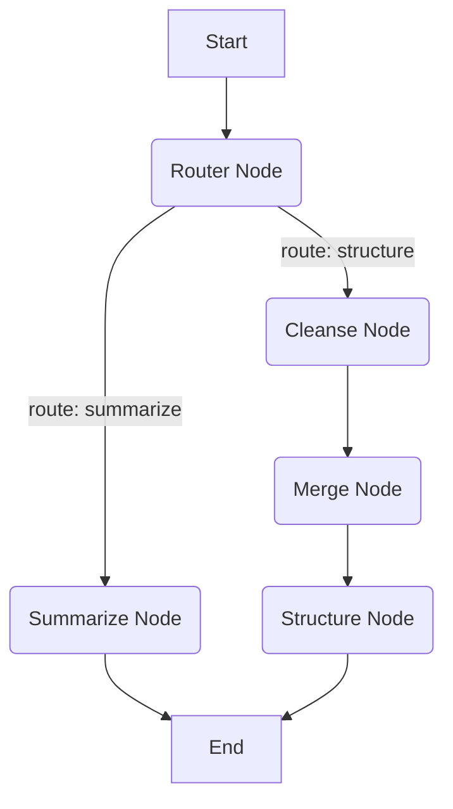

# PRD: Data Cleansing & Structuring Pipeline (데이터 정제 및 구조화 파이프라인)

## 1. 개요 (Overview)
LogiVOC 시스템은 현재 문서 업로드 시 단순 요약을 수행하는 LangGraph 파이프라인을 중심으로 구성되어 있습니다. 그러나 다량의 중복 데이터를 포함하는 엑셀 파일이나 로그성 원본 데이터를 처리할 때 요약만으로는 원본 데이터의 손실이 발생하고, 구조화되지 않은 형태로 결과가 도출되는 한계가 있습니다. 
본 문서는 기존의 단순 요약 중심의 파이프라인을 개선하여 **원본 데이터를 최대한 보존하면서 노이즈 제거, 중복 데이터 병합, 구조화 포맷(JSON, Markdown Table 등) 변환**을 수행하는 데이터 정제 및 구조화 파이프라인으로의 개편 방안 및 요구사항을 정의합니다.

## 2. 현황 및 문제점 (Current Problems)
- **원본 데이터 손실:** 기존 요약 중심 파이프라인은 텍스트의 핵심만 추출하기 때문에 세부적인 속성 값이나 통계적 데이터가 손실됨.
- **중복 및 노이즈 방치:** 다량의 로우 데이터(엑셀, CSV 등)에 포함된 불필요한 메타데이터나 단순 중복 데이터가 걸러지지 않아 결과물의 질을 하락시킴.
- **활용하기 어려운 출력 포맷:** 결과물이 단순 텍스트로 반환되어 후속 데이터 분석이나 UI에서의 표, 차트 렌더링에 직접 활용하기 어려움.

## 3. 목표 (Objectives)
- **원본 보존 기반 정제:** 데이터의 고유한 의미나 속성 값을 유지하면서 의미 없는 노이즈를 제거.
- **스마트 중복 병합:** 동일하거나 유사한 데이터 레코드를 식별하여 병합(Merge)하고 카운트(Count) 등의 속성을 부여.
- **정형화된 구조 도출:** 분석 및 UI 표현에 용이한 JSON이나 Markdown Table 형태의 최종 결과물 생성.
- **유연한 파이프라인 분기:** 파일의 종류(PDF/Word 등 서술형 문서 vs Excel/CSV 등 정형 데이터)나 사용자의 요청(요약 vs 구조화)에 따라 적절한 파이프라인 경로를 타도록 LangGraph 라우팅 구조 개선.

## 4. 기능 요구사항 (Functional Requirements)

### 4.1. 파일 타입 및 의도 분석 (Intent & Type Analysis)
- 업로드된 파일의 확장자(Excel, CSV 등) 및 내용 특징을 분석하여 파이프라인 라우팅 기준을 설정.
- 사용자 입력(프롬프트)에 "정제", "구조화", "표로 만들어줘" 등의 키워드가 있을 경우 구조화 파이프라인으로 라우팅.

### 4.2. 노이즈 제거 (Noise Filtering)
- 원본 데이터에서 의미가 없는 특수문자, 불필요한 공백, 헤더/푸터 잔여물 등을 필터링.
- 도메인과 무관한 시스템 로그나 에러 코드 등 제외 가능 옵션 제공.

### 4.3. 중복 데이터 식별 및 병합 (Deduplication & Merging)
- 유사도 기반 혹은 키(Key) 매칭 기반으로 중복 항목을 검색.
- 중복 항목 발견 시, 대표 항목 하나로 병합하고 발생 빈도(Count)나 관련 ID 목록을 배열로 유지하여 원본 추적성을 보존.

### 4.4. 데이터 구조화 (Data Structuring)
- 정제 및 병합된 데이터를 명확한 스키마(Schema)를 갖춘 JSON 포맷으로 변환.
- 사용자에게 보여줄 가독성 높은 Markdown Table 포맷 생성 기능 지원.

## 5. 기술적/구조적 검토 (Technical Architecture / Pipeline Refactoring)

기존 `backend/app/pipeline/`의 LangGraph 구조를 다음과 같이 개편하는 방안을 제안합니다.

### 5.1. 상태 스키마(`state.py`) 확장
기존 요약 텍스트 중심의 상태에서, 데이터 구조화 결과를 담을 필드를 추가해야 합니다.
```python
class GraphState(TypedDict):
    input_text: str
    file_type: str        # 'document' or 'spreadsheet'
    pipeline_route: str   # 'summarize' or 'structure'
    filtered_data: list   # 노이즈 제거된 데이터 리단위
    merged_data: list     # 중복 병합된 데이터 리단위
    structured_output_json: str
    structured_output_md: str
    final_output: str
```

### 5.2. 조건부 라우팅 엣지(`edges.py`) 도입
기존 단일 흐름(선형) 그래프를 분기형 그래프로 변경합니다.
- **Node: `router_node`**
  - 입력 데이터를 분석하여 `pipeline_route`를 결정.
- **Edge: `route_pipeline`**
  - `pipeline_route == 'summarize'` -> `summarize_node`로 분기
  - `pipeline_route == 'structure'` -> `cleanse_node`로 분기

### 5.3. 신규 노드(`nodes.py`) 구성
데이터 구조화를 위한 전용 노드들을 추가합니다.
1. **`cleanse_node`:** 노이즈 제거 및 데이터 정규화 수행 (LLM 또는 정규식/Pandas 결합).
2. **`merge_node`:** 정규화된 데이터를 대상으로 중복 식별 및 병합 로직 수행.
3. **`structure_node`:** 병합된 결과를 프롬프트를 활용해 JSON 및 Markdown Table로 변환.

### 5.4. 파이프라인 그래프 시각화 (Mermaid)


## 6. 비기능 요구사항 (Non-Functional Requirements)
- **성능:** 다량의 데이터(예: 1,000행 이상의 엑셀)를 LLM으로 한 번에 처리할 경우 Context Window 초과 및 속도 저하가 발생할 수 있습니다. 이를 방지하기 위해 Chunking(분할 처리) 또는 Pandas를 활용한 프로그래밍 방식의 전처리(Pre-processing)를 LLM과 혼합하여 사용해야 합니다.
- **안정성:** 구조화된 JSON 반환 시 파싱 에러를 방지하기 위해 LLM의 응답 모드(예: JSON Mode, Structured Output)를 반드시 적용해야 합니다.
- **확장성:** 향후 차트 생성 등 다른 시각화 기능 추가 시 쉽게 노드를 덧붙일 수 있어야 합니다.

## 7. 향후 계획 및 다음 단계
- **아키텍처(Phase 2):** 아키텍트(architect)는 본 PRD를 바탕으로 `docs/specs/architecture.md` 및 `docs/specs/api-data-structuring.md` 문서를 작성하고 세부 LangGraph 스펙을 확정합니다.
- **데이터 엔지니어/AI 개발자(Phase 3):** Pandas 기반의 전처리와 LangGraph 노드 추가 로직을 분담하여 구현합니다.
