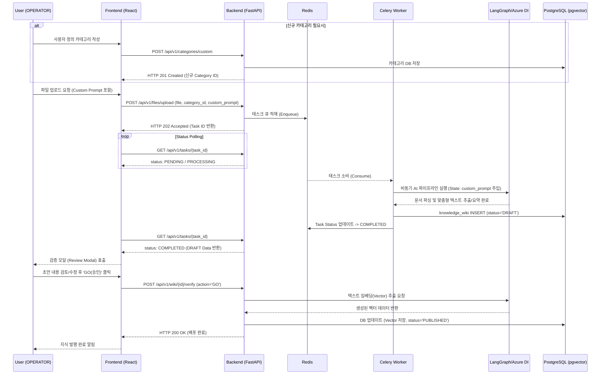

# LogiVOC (OmniLog AI) 아키텍처 및 기술 스펙

본 문서는 `LogiVOC` 플랫폼의 시스템 아키텍처, 데이터베이스 스키마 및 주요 백엔드/프론트엔드 설계 사양을 정의합니다. 본 문서는 최신 `PRD_SUMMARY_KO.md`를 기반으로 작성되었습니다.

## 1. 시스템 아키텍처 구조 (System Architecture)

전체 시스템은 비동기 파이프라인 처리를 지원하는 마이크로서비스 지향 모놀리식 구조로 설계되었습니다.

```mermaid
graph TD
    %% Frontend
    subgraph Frontend [Frontend (React + Vite + Tailwind)]
        UI_WS[Workspaces View]
        UI_DataReg[Data Registration View]
        UI_Admin[Admin View - Dashboard & Users]
    end

    %% API Gateway & Backend
    subgraph Backend [Backend (FastAPI)]
        API_Auth[Auth API / JWT]
        API_Upload[File Upload API]
        API_Verify[Verification API]
        API_Search[Search API]
        API_Cat[Category API]
        API_Admin[Admin API]
        
        API_Auth --> API_Upload
        API_Auth --> API_Verify
        API_Auth --> API_Admin
    end

    %% Async Worker
    subgraph Async [Async AI Pipeline]
        Worker_Celery[Celery Worker]
        LangGraph[LangGraph Pipeline]
        Azure_DI[Azure Document Intelligence]
        LLM[OpenAI API GPT-4o]
        
        Worker_Celery --> LangGraph
        LangGraph --> Azure_DI
        LangGraph --> LLM
    end

    %% Message Broker
    subgraph Broker [Message Broker]
        Redis[Redis]
    end

    %% Database
    subgraph DB [Database (PostgreSQL)]
        Table_Cat[categories]
        Table_Wiki[knowledge_wiki]
        PGVector[pgvector]
    end

    Frontend -->|HTTP / REST| Backend
    API_Upload -->|Queue Task| Redis
    Redis -->|Consume| Worker_Celery
    
    Backend --> DB
    Worker_Celery -->|Store DRAFT| DB
```

### 1.1 에이전트 하네스 개발/검증 파이프라인 (Agent Harness SDLC)
LogiVOC 개발 환경은 `Anchor AI Multi-Agent Harness`에 의해 제어됩니다. 사용자(PM)와 13개의 에이전트 간 위임과 훅(Hook)을 통해 파이프라인이 철저하게 문서 기반으로 관리됩니다.
- **`pre-phase.sh`**: 단계(Phase) 진입 전 산출물 및 이전 상태 검증.
- **`quality-gate.sh`**: 개발자(Backend/Frontend) 에이전트가 QA로 핸드오버하기 전 반드시 통과해야 하는 린트/정적 분석 훅.
- **`post-task.sh`**: 에이전트 태스크 종료 후 `test` 스킬 실행 및 자동 결과 로깅.
- 이 모든 과정은 자율 에이전트들의 마크다운 문서(`docs/`) 스펙 기반으로만 수행되며, 메인 에이전트(PM)의 Zero-Touch 원칙이 적용됩니다.

```mermaid
graph TD
    %% Agent Harness Workflow
    subgraph Phase 1 [Phase 1: Planning]
        RA[requirements_analyst]
    end

    subgraph Phase 2 [Phase 2: Design]
        ARC[architect]
        UI[ui_ux_designer]
        DB[dba]
    end

    subgraph Phase 3 [Phase 3: Implementation]
        FD[frontend_dev]
        BD[backend_dev]
        AD[ai_dev]
        DE[data_engineer]
    end

    subgraph Phase 4 [Phase 4: Verification / QA Delegation]
        DO[devops_mlops]
        QA[qa_engineer]
        SE[security_expert]
    end

    subgraph Phase 5 [Phase 5: User Acceptance Testing]
        UA[user_agent]
    end

    subgraph Phase 6 [Phase 6: Sign-off]
        PM[Main Agent - PM]
        PMO[pmo]
    end

    %% Workflow Flow
    Phase 1 -->|PRD & Requirements| Phase 2
    Phase 2 -->|Architecture & UI Specs| Phase 3
    Phase 3 -->|Code Implementation| Hooks{Quality Gate Hooks}
    Hooks -->|Pass| Phase 4
    Hooks -->|Fail| Phase 3
    Phase 4 -->|Verified (Reports)| Phase 5
    Phase 4 -->|Defects Found| Phase 1
    Phase 5 -->|UAT Approved| Phase 6
    Phase 5 -->|Issues Found| Phase 1
```

## 2. 주요 기술 스펙 (Technical Specifications)

### 2.1 백엔드 디렉터리 구조 및 모듈화 (Backend Directory Refactoring)
Phase 1(ADR 004) 및 Phase 2 2차 리팩토링(ADR 005) 결정에 따라 백엔드 구조를 완벽한 Controller-Service-Repository 패턴과 모듈형 AI 파이프라인으로 개편합니다.

*   **`app/api/` (Controller)**: 라우트 엔드포인트(`routers/`) 및 공통 의존성(`dependencies.py`) 관리. API 요청 검증 및 응답 반환을 담당합니다.
*   **`app/services/` (Service)**: 핵심 비즈니스 로직 캡슐화. 컨트롤러와 데이터 입출력 사이에서 복잡한 연산이나 외부 서비스 연동을 처리합니다.
*   **`app/crud/` (Repository)**: 데이터베이스 CRUD 연산 로직 전담. 순수한 DB 제어 로직만 담당하도록 제한합니다.
*   **`app/models/` & `app/schemas/`**: SQLAlchemy ORM 모델과 Pydantic 스키마 정의.
*   **`app/core/`**: 시스템 인프라 설정(`config.py`, `database.py`, `security.py` 등) 통합 관리.
*   **`app/pipeline/`**: LangGraph 기반 AI 파이프라인. `state.py`, `nodes.py`, `edges.py`, `graph.py`로 완벽히 분리되어 테스트 및 확장을 지원합니다.
*   **`app/worker/`**: Celery 애플리케이션 초기화(`celery_app.py`) 및 태스크(`tasks.py`) 정의.

#### 백엔드 모듈 아키텍처 다이어그램
```mermaid
graph TD
    %% Client Request
    Client[Client Request / Response]

    %% API Layer (Controller)
    subgraph API [app/api/]
        Dependencies[dependencies.py]
        Routers[routers/ (Endpoints)]
        Client <-->|REST| Routers
        Routers -.->|Inject| Dependencies
    end

    %% Service Layer
    subgraph Service [app/services/]
        BizLogic[Business Logic & Orchestration]
        Routers -->|Call| BizLogic
    end

    %% Repositories and Data
    subgraph Data Layer [Data Access]
        CRUD[app/crud/ (Repository)]
        Schemas[app/schemas/ (Pydantic)]
        Models[app/models/ (SQLAlchemy)]
        BizLogic -->|Transform| Schemas
        BizLogic -->|Query/Command| CRUD
        CRUD -.-> Models
    end

    %% AI Pipeline Layer
    subgraph AI Pipeline [app/pipeline/]
        State[state.py (State Types)]
        Nodes[nodes.py (Agent Tasks)]
        Edges[edges.py (Routing logic)]
        Graph[graph.py (Graph Builder)]
        Graph --> Nodes
        Graph --> Edges
        Nodes -.-> State
    end

    %% Async Worker
    subgraph Worker [app/worker/]
        Tasks[tasks.py]
        Celery[celery_app.py]
        Tasks -.-> Celery
        Tasks -->|Invoke| Graph
    end

    %% DB & Infrastructure
    DB[(PostgreSQL)]
    CRUD --> DB

    BizLogic -->|Enqueue| Tasks
```

이를 통해 컨트롤러-서비스-리포지토리 계층의 역할 분리를 명확히 하고, 단일 파일이었던 비대한 `ai_pipeline.py`를 논리적으로 쪼개어 테스트 용이성과 향후 다중 파이프라인 확장을 유연하게 지원합니다.

### 2.2 비동기 AI 파이프라인 (Asynchronous AI Pipeline)
대용량 IT 운영 문서(매뉴얼, 로그, 트러블슈팅 이력) 업로드 시 메인 스레드의 블로킹을 방지하기 위해 완전한 비동기 백그라운드 아키텍처를 도입했습니다.
*   **Celery & Redis**: FastAPI가 파일 업로드 요청을 받으면 Redis 브로커를 통해 Celery 워커로 태스크를 이관합니다. 프론트엔드는 제공받은 `Task ID`로 상태를 폴링합니다.
*   **Azure Document Intelligence 통합**: 임시 파서 대신 실 서비스용 파싱 API를 연동하여 표/텍스트/구조화 데이터를 추출합니다.
*   **LangGraph 기반 데이터 구조화**: 추출된 데이터를 LangGraph 워크플로우에 통과시켜 요약, 메타데이터 추출, 환각(Hallucination) 검증을 수행합니다.
*   **동적 커스텀 프롬프트 주입 (Dynamic Prompt Injection)**: 사용자가 데이터 등록 시 입력한 커스텀 프롬프트(Ad-hoc Custom Prompt)는 API를 거쳐 LangGraph의 `GraphState`에 주입됩니다. AI 처리 노드는 이 상태값을 템플릿에 동적 병합하여 맞춤형 데이터 구조화를 수행합니다. (상세 내용은 ADR 002 참조)
*   **한국어 출력 강제 (Bug-5 Policy)**: 원본 문서의 언어(예: 영문 매뉴얼, 로그)에 관계없이 요약, 제목 등 추출되는 모든 결과물은 100% 한국어로 생성되도록 프롬프트를 강제 적용합니다.
*   **안전한 Fallback**: 외부 AI API(Azure DI, OpenAI 등) 호출 실패 혹은 네트워크 예외 발생 시, 시스템 중단 대신 카테고리를 기본값(Default)으로 매핑하여 안전하게 동작하도록 폴백(Fallback) 처리합니다.

### 2.2 인증 및 JWT 권한 관리 (Authentication & JWT Authorization)
MVP 단계에서는 외부 SSO나 복잡한 OAuth 대신 내부 JWT 기반 Mock 인증을 사용합니다.
*   **역할(Role) 분리**:
    *   `ADMIN`: 시스템 카테고리 관리, 사용자 권한 설정, 모든 문서의 DRAFT 검토 및 삭제 등 전권 보유.
    *   `OPERATOR`: 문서 업로드 및 DRAFT 상태의 지식 검증(`GO`/`STOP` 처리) 권한 보유.
    *   `VIEWER`: PUBLISHED 상태의 지식에 대한 자연어 검색 및 열람만 가능.
*   **JWT 인증 체계**: FastAPI의 `OAuth2PasswordBearer`를 사용하여 JWT 토큰을 발급/검증하며, 각 API 엔드포인트에 Role-based Access Control (RBAC)을 적용합니다.
*   **API 연동 규격 일치(Strict Payload Specification)**: 프론트엔드와 백엔드 간 로그인 등 API 통신 시, 요청 Payload(예: `username`, `password`)는 사전에 합의된 스키마에 완전히 일치해야 합니다. 이를 통해 데이터 바인딩 오류(422 Unprocessable Entity)를 사전에 차단합니다.

### 2.3 벡터 검색 엔진 (Vector Search Engine with pgvector)
기존의 단순 키워드 검색을 넘어 자연어(문맥) 기반 검색을 제공합니다.
*   **`pgvector` 확장**: PostgreSQL 내부에서 임베딩 벡터를 직접 저장하고 연산합니다. 별도의 Vector DB(Pinecone, Milvus 등) 구축 비용과 관리 포인트를 제거합니다.
*   **HNSW (Hierarchical Navigable Small World) 인덱스**: 빠른 유사도 검색(Cosine Similarity) 성능을 위해 `pgvector`의 HNSW 인덱스를 벡터 컬럼에 적용합니다.
*   **상태 기반 검색 제한**: DRAFT(검증 대기) 상태의 데이터는 검색 결과에서 배제하며, 오직 `PUBLISHED`(승인 완료) 상태의 지식만 사용자에게 노출합니다.

### 2.4 실용적 온톨로지 구조
*   `categories` 테이블은 `Service > Module > Architecture` 의 3단계 계층 구조를 갖습니다.
*   각 카테고리는 `custom_prompt` 컬럼을 포함하여, 해당 카테고리로 매핑된 지식을 AI가 처리할 때 주입할 맞춤형 프롬프트(예: "DB 트러블슈팅 시 인덱스 관련 항목 강조")를 관리합니다.

### 2.5 테스트 인프라 전략 (Testing Infrastructure Strategy)
QA 및 CI/CD 환경에서의 안정성과 개발자 로컬 환경의 편의성을 위해 Docker 데몬 의존성을 최소화하는 독립적인 테스트 인프라 전략을 적용합니다.

*   **인메모리 데이터베이스 및 Mock 서버 활용**: 로컬 단위/통합 테스트 시 무거운 PostgreSQL이나 Redis 컨테이너 구동 없이, 인메모리 DB(SQLite 등) 및 Mock 브로커(Mock Redis, Fakeredis 등)를 사용하여 테스트 실행.
*   **환경 설정 분리 (`.env.test`)**: 테스트 실행 전용 환경 설정 파일(`.env.test`)을 분리하여 명문화. 개발/운영 환경과 테스트 환경을 완벽히 분리.
*   **CI 환경 호환성**: 외부 의존성(Docker 데몬 등)을 배제하여 CI 파이프라인에서 테스트가 빠르고 안정적으로 수행될 수 있도록 보장.
*   **프론트엔드 E2E 테스트 통합(Integrated E2E)**: 테스트 스크립트(예: `run_test.sh`)에서 백엔드 서버(FastAPI)를 로컬로 통합 구동한 상태에서 테스트를 수행하도록 구성합니다. 이 때 **포트 충돌 방지(Port Conflict Resolution)**를 위해, 서버 구동 전 반드시 대상 포트(예: 8088)를 점유하고 있는 기존 프로세스를 찾아 안전하게 종료(Kill)하는 로직을 스크립트에 포함해야 합니다.
*   **하네스 UI 테스트 커버리지 (Harness UI Test Coverage)**: 신규 하네스 워크플로우 관련 UI 컴포넌트(검증 모달, `GO`/`STOP` 버튼 등)에 대해 프론트엔드 E2E 기능 테스트 스크립트를 신규로 작성하고 필수적으로 통과해야 합니다. 이 때 요소 식별을 위해 `data-testid` 속성이 강제됩니다.
*   **비동기 상태 정합성 보장 (Async Polling Resolution)**: 자동화 E2E 테스트 환경에서 Celery Eager Mode 등 비동기 워커를 테스트할 때, 프론트엔드의 작업 상태 폴링 로직이 무한 대기(타임아웃)에 빠지지 않도록 테스트 아키텍처 환경이 보완되어야 합니다. 백엔드 작업 조회 API를 즉시 SUCCESS/COMPLETED로 반환하도록 Mocking 하거나 실제 Worker 환경을 구동하여 테스트 정합성을 확보해야 합니다.

### 2.6 보안 아키텍처 원칙 (Secure Architecture Principles)
안전한 파일 처리 및 권한 관리를 위해 다음의 원칙을 강제합니다.
*   **Prompt Injection 방어**: 
    *   **프롬프트 입력 길이 제한**: API 및 애플리케이션 레벨에서 커스텀 프롬프트 길이를 최대 500자로 제한합니다.
    *   **입력 필터링**: 악의적 특수 기호 및 Jailbreak 유도 키워드를 API 게이트웨이 및 미들웨어 레벨에서 차단합니다.
    *   **시스템 프롬프트 격리**: LangGraph 파이프라인에서 시스템 메인 지시어(SystemMessage)와 커스텀 프롬프트(HumanMessage 또는 격리된 Context)를 엄격히 분리하여 시스템 지시어가 무력화되지 않도록 방어합니다.
*   **DoS(서비스 거부) 공격 방어**:
    *   **파일 업로드 제한**: 단일 파일 업로드 크기를 최대 5MB로 제한합니다.
    *   **Rate Limiting**: 동일 사용자의 API(특히 업로드 및 파이프라인 실행) 호출 빈도를 제한(예: 분당 10회)합니다.
    *   **비동기 워커 타임아웃**: Celery Task 처리 시 Soft Time Limit(60초) 및 Hard Time Limit(90초)을 설정하여 무한 대기 및 워커 자원 고갈을 방지합니다.
*   **안전한 임시 파일 처리 (Secure Temporary Files)**: 문서 업로드 등에서 발생하는 모든 임시 파일 생성은 절대 하드코딩된 경로(예: `/tmp/`)를 사용하지 않습니다. 반드시 Python 내장 `tempfile` 모듈(`NamedTemporaryFile` 등)을 사용하여 OS가 보장하는 안전한 임시 디렉토리 및 랜덤 파일명을 사용해야 합니다. 이를 통해 CWE-377(Insecure Temporary File) 취약점을 방지합니다.

### 2.7 인프라 환경변수 무결성 (Infrastructure Environment Integrity)
*   **필수 환경변수 검증**: 애플리케이션 및 컨테이너 기동에 필수적인 설정(예: `JWT_SECRET_KEY`, DB URI 등)은 `docker-compose.yml` 및 배포 스크립트에 누락 없이 명시되어야 합니다. 환경변수 누락으로 인한 런타임 오류(서버 크래시)를 방지하기 위해 인프라 스크립트 리뷰 시 무결성을 확보해야 합니다.

### 2.8 데이터베이스 동기화 및 마이그레이션 (Database Migration Strategy)
*   **Alembic 스크립트 작성 의무화**: 시스템 스키마(모델) 변경 시, 데이터베이스 동기화를 위해 반드시 Alembic 마이그레이션 스크립트를 작성하여 배포 파이프라인에 포함해야 합니다.
*   **pgvector 익스텐션 명문화**: `pgvector`와 같은 특수 데이터 타입을 사용할 경우, 마이그레이션 스크립트 내부(혹은 별도 초기화 훅)에 `CREATE EXTENSION IF NOT EXISTS vector;` 로직을 필수적으로 포함하여 DB 인스턴스 초기화 시 에러가 발생하지 않도록 강제합니다.
## 3. 대화형 검증 프로세스 시퀀스 다이어그램 (Interactive Verification Sequence)

문서가 업로드되어 AI가 초안을 생성하고, 운영자가 이를 검수하여 최종 발행하는 워크플로우입니다.


