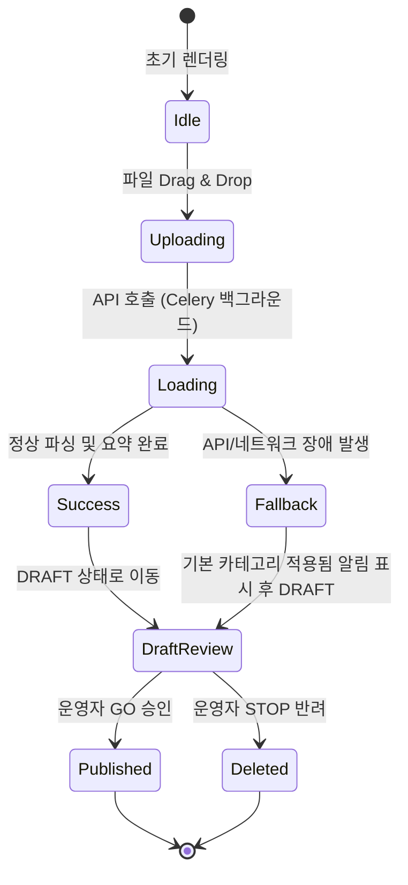

# LogiVOC (OmniLog AI) UI/UX Guidelines

## 1. 개요 (Overview)
본 문서는 LogiVOC 플랫폼의 일관된 사용자 경험과 인터페이스 디자인을 위한 UI/UX 가이드라인을 정의합니다. 본 가이드라인은 PRD의 3-Tab 분리 구조 요구사항과 현재 프론트엔드의 React + Tailwind CSS 구현체를 기반으로 작성되었습니다.

## 2. 레이아웃 구조 (Layout Structure)
플랫폼은 직관적인 네비게이션을 위해 상단 GNB(Global Navigation Bar)와 3-Tab 구조를 채택합니다.

### 2.1 상단 네비게이션 (GNB)
*   **위치**: 화면 상단에 고정 (Sticky Header)
*   **스타일**: 반투명(Glassmorphism) 효과를 적용한 백그라운드 (`bg-slate-900/50 backdrop-blur-md`)
*   **구성요소**: 
    *   **로고 영역**: 좌측 위치, 그라데이션 아이콘 및 텍스트 (`bg-gradient-to-r from-indigo-300 to-purple-300`)
    *   **3-Tab 메뉴**: 중앙/우측 위치, 아이콘과 텍스트 조합

### 2.2 3-Tab UI 구조
1.  **Workspace (작업 공간)**
    *   **목적**: 문서 업로드 및 AI 파이프라인 DRAFT 검증, 편집, 승인/반려
    *   **레이아웃**: 2-Column Split View
        *   **Left Panel (1/3 비율)**: 문서 업로드 영역 (Drag & Drop), 최근 DRAFT 목록 표시
        *   **Right Panel (2/3 비율)**: DRAFT 선택 시 나타나는 편집 화면 (Original Viewer와 Extracted Data Panel의 병렬 배치)
2.  **Dashboard / Search (검색 및 대시보드)**
    *   **목적**: PUBLISHED 상태의 지식 검색 및 시스템 운영 현황 확인
    *   **레이아웃**: 상단 검색바, 하단 검색 결과 및 통계 카드 리스트로 구성
3.  **System Admin (시스템 관리)**
    *   **목적**: 온톨로지 카테고리 트리 관리 및 프롬프트 설정
    *   **레이아웃**: 좌측 트리 구조 네비게이션, 우측 설정 폼(Form) 구조

## 3. 디자인 토큰 및 시각 규칙 (Design Tokens & Visual Rules)

### 3.1 색상 팔레트 (Color Palette)
Tailwind CSS의 기본 색상을 활용하되, 다크 테마 기반의 프리미엄 UI를 지향합니다.
*   **Background (배경)**
    *   Global: `linear-gradient(135deg, #0f172a 0%, #1e1b4b 100%)` (Slate-900에서 깊은 Indigo로 이어지는 그라데이션)
    *   Panel: `bg-slate-900/60`, `bg-slate-950/50` (투명도 조절로 계층감 부여)
*   **Text (텍스트)**
    *   Primary: `text-slate-100` 또는 `text-white`
    *   Secondary: `text-slate-400`, `text-indigo-200`
    *   Accent: `text-transparent bg-clip-text bg-gradient-to-r from-indigo-300 to-purple-300`
*   **Primary Accent (포인트 컬러)**
    *   `indigo-400`, `indigo-500`, `purple-500` 활용
*   **Status Colors (상태 색상)**
    *   Success/Go: `green-400`
    *   Warning/Pending: `amber-400`
    *   Danger/Stop: `red-400`

### 3.2 타이포그래피 (Typography)
*   **글꼴**: 시스템 기본 폰트 스택 (Inter, system-ui, Avenir, Helvetica, Arial, sans-serif)
*   **크기 규칙**:
    *   **Page Title**: 텍스트 크기 `xl` 이상, `font-bold`
    *   **Panel Title**: `text-lg font-bold`
    *   **Body Text**: `text-sm` 또는 기본 텍스트 크기, `leading-relaxed`
    *   **Metadata/Hint**: `text-xs text-slate-500`

### 3.3 시각적 효과 및 컴포넌트 스타일 (Visual Effects)
*   **Glassmorphism (유리 질감 효과)**
    *   패널 및 카드 배경에 적용: `background: rgba(255, 255, 255, 0.03); backdrop-filter: blur(16px);`
    *   테두리: `border 1px solid rgba(255, 255, 255, 0.05)`
    *   그림자: `box-shadow: 0 4px 30px rgba(0, 0, 0, 0.1)`
*   **Rounded Corners (모서리 둥글기)**
    *   패널 및 컨테이너: `rounded-2xl`
    *   버튼, 인풋, 작은 카드: `rounded-xl`
*   **Forms (입력 폼)**
    *   배경: `bg-slate-950/50`
    *   테두리: `border-white/10` (포커스 시 `border-indigo-500/50`)

## 4. 마이크로 인터랙션 (Micro-Interactions)
*   **애니메이션 (CSS Keyframes)**
    *   `fade-in`: 0.8s ease-out
    *   `slide-up`: 0.8s ease-out, Y축 이동 (초기 렌더링 시 컨텐츠 등장 효과)
*   **Hover/Focus 상태**
    *   버튼, 네비게이션 아이템: 색상 전환(`transition-colors`) 및 그림자 강조(`hover:shadow-indigo-500/40`)
    *   드래그 앤 드롭 영역: 파일 진입 시 `border-indigo-400 bg-indigo-500/10`로 상태 변경
*   **로딩 (Loading State)**
    *   비동기 작업 시 전체 화면 오버레이 및 `lucide-react`의 `Loader2`를 활용한 회전(`animate-spin`) 애니메이션
    *   추가적인 펄스 효과(`animate-pulse`)로 처리 진행 상태 피드백 제공

## 5. 아이콘 (Iconography)
*   **라이브러리**: `lucide-react`
*   **활용 규칙**: 
    *   메뉴나 버튼 텍스트 옆에 16x16(`w-4 h-4`) 또는 20x20(`w-5 h-5`) 사이즈로 배치하여 시각적 인지 향상
    *   비어있는 상태(Empty State)를 나타낼 때는 큰 사이즈(예: `w-16 h-16`)와 투명도(`opacity-50`) 적용

## 6. 멀티 에이전트 하네스 환경의 UI/UX 개발 정책 (SDLC & Hand-over)
새롭게 도입된 **Anchor AI Multi-Agent Harness** 워크플로우에 따라, 본 UI/UX 가이드라인은 사람(개발자)뿐만 아니라 하위 AI 에이전트(`frontend_dev`, `qa_engineer` 등)가 명확하게 인지하고 구현 및 테스트할 수 있도록 작성되어야 합니다.

### 6.1 Agent 친화적 설계 명세 (Machine-Readable UI Specs)
*   모든 디자인 속성(색상, 여백, 크기 등)은 모호한 표현 대신 **Tailwind CSS 클래스명** 또는 명시적인 CSS 값으로 기술합니다.
*   기능 추가 시 `frontend_dev` 에이전트가 임의로 디자인을 추론하지 않도록 상태별(Hover, Active, Error, Disabled 등) UI 명세를 빠짐없이 문서화해야 합니다.

### 6.2 QA 에이전트 테스트를 위한 식별자 규칙 (Testability)
*   `qa_engineer` 및 `user_agent`가 E2E/UAT 테스트를 원활히 수행할 수 있도록, 핵심 UI 컴포넌트(버튼, 폼, 모달, 네비게이션 탭 등)에는 반드시 `data-testid` 속성을 부여하도록 설계합니다.
*   예시: Workspace 탭은 `data-testid="tab-workspace"`, 승인 버튼은 `data-testid="btn-go"` 등 직관적인 네이밍 컨벤션을 따릅니다.

### 6.3 렌더링 및 트랜지션 시퀀스 명세 (Mermaid Flow)
복잡한 화면 전환, 모달 호출, API 비동기 로딩 및 Fallback 화면 등의 UI 상태 변화(State Machine)는 **Mermaid 다이어그램**을 사용하여 시각적으로 명세해야 합니다. 이를 통해 개발/검증 에이전트 간 로직의 오해를 방지합니다.

### 6.4 철저한 문서 주도 개발 (Document-Driven)
*   UI/UX 설계 문서는 **Phase 2 (아키텍처 및 디자인 설계)** 단계에서 완성되며, 이는 **Phase 3 (기능 구현)**과 **Phase 4 (QA 및 검증)**의 절대적 기준이 됩니다. 문서에 명시되지 않은 애니메이션이나 디자인은 개발 에이전트가 자의적으로 구현할 수 없으며, 필요시 기획/디자인 문서 수정 루프(Phase 1~2)를 다시 거쳐야 합니다.
