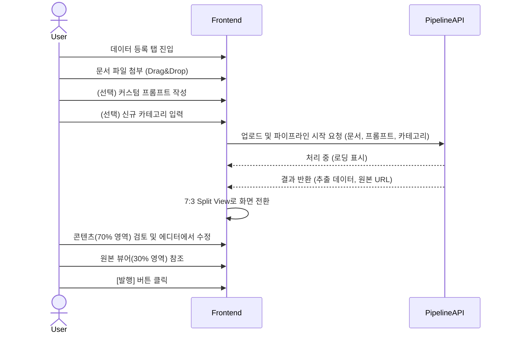

# UI/UX 가이드: 워크스페이스 고도화 및 관리자 기능 확장

## 1. 개요
본 문서는 `prd-workspace-enhancement.md`에서 정의된 요구사항을 바탕으로 작성된 UI/UX 설계 가이드입니다. 워크스페이스 기능의 분리, 시스템 관리자 페이지의 확장, 그리고 데이터 등록 화면의 레이아웃 최적화를 위한 화면 설계 지침을 제공합니다.

## 2. 글로벌 내비게이션 (GNB) 구조 변경

상단 또는 좌측 내비게이션 메뉴 구조가 다음과 같이 변경됩니다.

*   **기존 (As-Is):**
    *   Workspace
    *   Search
    *   System Admin
*   **변경 후 (To-Be):**
    *   **Workspace**: 시스템 접속 시 기본 화면. 통합 지식 검색 및 검색 결과 조회를 위한 메인 대시보드.
    *   **데이터 등록 (Data Registration)**: 신규 추가됨. 문서 업로드, AI 파이프라인 진행 상태, DRAFT 상태 문서 검토 및 승인/반려 워크플로우 수행.
    *   **System Admin**: 카테고리 관리 기능과 더불어 전체 DB 데이터 리스트 조회 및 관리 기능을 통합 제공.

## 3. 화면별 UI/UX 상세 가이드

### 3.1. Workspace (검색 및 조회 중심)
*   **레이아웃 구성**:
    *   상단(또는 중앙): 대형 검색창 (Hero Section)
    *   하단: 추천 키워드, 최근 검색 기록, 인기/최근 업데이트된 지식 카드 리스트
*   **주요 인터랙션**: 검색어 입력 시 드롭다운 형태의 자동완성 및 카테고리 필터링 칩(Chip) 제공.

### 3.2. 데이터 등록 (Data Registration)
이 탭은 문서를 시스템에 등록하고 AI를 통해 파싱, 요약, 카테고라이징하는 과정을 거쳐 최종 발행(Publish)하는 워크플로우 전체를 다룹니다.

#### 3.2.1. 문서 업로드 뷰 (Upload View)
*   **드래그 앤 드롭 영역**: 화면 중앙에 위치하여 직관적인 파일 업로드 지원.
    *   **업로드 제한 안내 및 에러 UI**: 드래그 영역 내에 "최대 5MB 이하의 파일만 업로드 가능합니다"라는 안내 문구를 명시적으로 표기.
    *   제한 초과 시, 영역 테두리를 붉은색으로 변경하고 에러 메시지("파일 크기가 5MB를 초과했습니다.")를 스낵바나 툴팁으로 표시.
*   **[신규] 파이프라인 옵션 패널**: 업로드 영역 하단에 아코디언 형태 또는 고정 폼으로 제공.
    *   **커스텀 프롬프트 (Custom Prompt)**: 사용자가 AI의 추출 및 요약 방식을 제어할 수 있는 `<textarea>` 제공. 
        *   Placeholder: "예: 이 문서에서 API 명세서 부분만 중점적으로 추출하고 요약해줘."
        *   **길이 제한 UI**: 입력창 하단에 현재/최대 글자 수(예: `0/500`)를 실시간 카운터로 표시. 초과 시 입력 방지 및 경고 색상(Red) 적용.
        *   **보안 필터링 안내**: 폼 근처에 "특수 문자 및 시스템 지시어는 자동으로 필터링됩니다."라는 도움말 텍스트(Help text) 추가.
    *   **사용자 정의 카테고리 (Custom Category)**:
        *   기존 카테고리 선택 드롭다운 (검색 가능)에 `[+ 새 카테고리 추가]` 버튼을 내장.
        *   클릭 시 인라인 텍스트 입력창 또는 모달을 띄워 계층구조(`분류 > 중분류`)를 직접 텍스트로 입력할 수 있도록 UI 제공.

#### 3.2.2. 데이터 검토 및 편집 뷰 (Review & Edit View)
업로드된 문서가 파이프라인을 거친 후 나타나는 화면입니다. 이 화면의 레이아웃이 콘텐츠 중심으로 대폭 변경됩니다.

*   **화면 스플릿 (Split Layout)**: 좌우 또는 상하 패널 구조 활용. 가로(Row) 배치를 기본으로 함.
*   **비율**: **콘텐츠(추출 결과) 7 : 원본 문서 뷰어 3** (사용자가 드래그하여 패널 크기를 조절할 수 있는 Resizer 컴포넌트 적용 권장, 단 기본값은 7:3)
*   **콘텐츠 영역 (좌측/메인, 70%)**:
    *   AI가 추출한 텍스트, 요약문, 메타데이터 입력 폼.
    *   텍스트 에디터(Rich Text Editor)를 적용하여 사용자가 쉽게 내용을 수정하고 포맷팅할 수 있도록 지원.
    *   상단에 커스텀 프롬프트 및 사용자 정의 카테고리 반영 결과를 뱃지(Badge) 형태로 표시.
    *   하단에 [승인 및 발행(Publish)], [반려(Reject)], [임시저장(Save Draft)] 액션 버튼 크게 배치.
*   **원본 문서 뷰어 (우측/서브, 30%)**:
    *   PDF, 이미지 등의 원본 문서를 스크롤/줌하며 참고할 수 있는 뷰어 창.
    *   공간이 좁으므로 필요 시 전체화면으로 띄우는 토글 버튼 제공.

### 3.3. 시스템 관리자 (System Admin)
*   **통합 대시보드 및 리스트 뷰**:
    *   좌측 LNB(Local Navigation Bar)를 추가하여 서브 메뉴 제공: `대시보드`, `데이터/지식 관리`, `사용자 관리`, `카테고리 관리`.
*   **데이터/지식 관리 화면 (신규 기능)**:
    *   모든 상태(DRAFT, PUBLISHED)의 데이터를 한눈에 볼 수 있는 데이터 그리드(Data Grid / Table) 제공.
    *   **컬럼(Columns)**: ID, 제목, 상태, 등록자, 등록일, 카테고리, 원본 파일명.
    *   **필터 및 검색**: 상단에 상태별 탭(All, Draft, Published)과 다중 조건 필터(기간, 작성자 등) 배치.
    *   **데이터 관리 액션**: 각 Row의 더보기 메뉴(점 3개 아이콘)를 통해 상세 보기, 권한 강제 수정, 삭제(Delete) 기능 제공. (삭제 시 재확인 모달 필수)

## 4. 모바일 및 반응형 (Responsive Web) 대응
*   **데이터 등록 리뷰 화면**: 모바일 해상도에서는 7:3 스플릿 뷰를 유지하기 어려우므로, 상하 스플릿 구조(콘텐츠 상단 60%, 뷰어 하단 40%)로 변경하거나, 탭(Tab) 구조로 `추출 내용` / `원본 문서` 분리 뷰를 제공.
*   **Admin Data Grid**: 테이블 열이 많으므로 모바일에서는 중요 정보(제목, 상태)만 노출하고, 클릭 시 세부 정보를 보여주는 Card List 형태로 변환.

## 5. UI 시퀀스 다이어그램 (데이터 등록)

