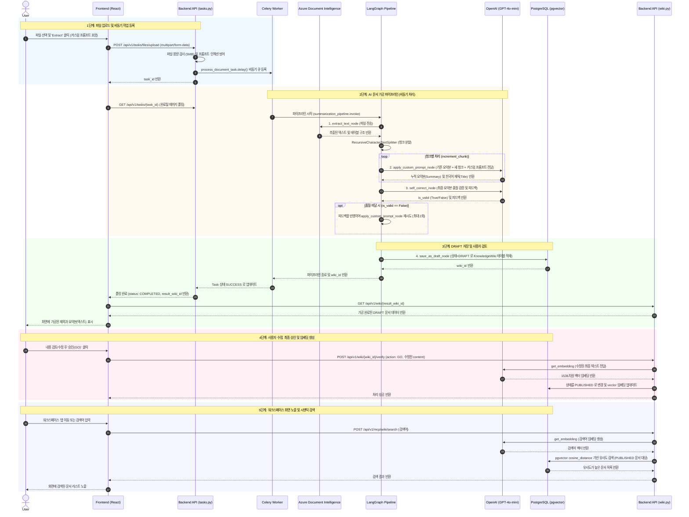

# 문서 업로드 및 AI 파이프라인 처리 시퀀스

본 문서는 사용자가 프론트엔드를 통해 파일을 업로드한 시점부터, 백엔드의 AI 가공 파이프라인(LangGraph)을 거쳐 DB에 적재(Draft)되고, 최종적으로 발행(Published)되어 워크스페이스 화면에 노출되기까지의 전체 데이터 흐름을 정의합니다.

## 1. 전체 시스템 시퀀스 다이어그램 (Mermaid)

## 2. 각 단계별 상세 데이터 흐름 및 로직

### Phase 1: 파일 업로드 (Data Registration 탭)
- **요청**: 프론트엔드에서 파일을 첨부하고 선택적으로 커스텀 프롬프트를 입력하여 업로드.
- **백엔드 로직 (`tasks.py`)**:
  - 파일 용량 5MB 제한 체크
  - 커스텀 프롬프트 내에 시스템 지시를 무력화하는 프롬프트 인젝션(Jailbreak) 키워드가 있는지 정규식으로 방어.
  - 보안을 위해 `tempfile`을 생성하여 디스크에 임시 저장.
  - Celery 큐에 `process_document_task` 비동기 작업을 던지고 프론트엔드에는 `task_id` 즉시 반환.
- **상태**: 사용자는 로딩 화면(폴링)을 대기함.

### Phase 2: LangGraph 기반 AI 파이프라인 가공 (`pipeline/`)
- Celery 워커가 작업을 수신하여 `summarization_pipeline.invoke()` 실행.
- **추출 (extract_text_node)**: `Azure Document Intelligence`를 호출하여 문서나 이미지에 포함된 텍스트와 테이블 구조를 추출. 추출된 텍스트를 `RecursiveCharacterTextSplitter`로 2,000자 단위 청크 분할.
- **요약 및 번역 (apply_custom_prompt_node)**: 분할된 청크를 순회하며 GPT-4o-mini를 통해 요약 수행.
  - **핵심 정책**: 원본 문서 언어와 관계없이(영어, 일본어 등) **반드시 100% 한국어**로 요약 및 제목을 생성.
  - 사용자가 입력한 커스텀 프롬프트가 있다면 시스템 프롬프트에 우선 적용하여 사용자 입맛에 맞게 데이터 형태 가공.
- **자가 검증 (self_correct_node)**: 도출된 요약본을 LLM이 다시 평가(Hallucination 점검 등). 피드백이 도출되면 최대 2회 재수행(Refine 루프).

### Phase 3: DB 임시 적재 (Draft) 및 검토 화면
- **저장 (save_as_draft_node)**: 파이프라인 가공이 끝나면 `KnowledgeWiki` DB 테이블에 상태를 `DRAFT`(초안)로 Insert. (이 단계에서는 아직 벡터 임베딩을 생성하지 않음).
- **출력**: 프론트엔드는 폴링을 통해 완료를 인지하고 반환받은 `wiki_id`로 DB에서 초안 데이터를 가져와 사용자 화면에 출력.

### Phase 4: 내용 검증 및 퍼블리싱 (Verify)
- **동작**: AI가 가공한 제목과 요약을 사용자가 화면에서 직접 읽어보고, 필요한 부분을 텍스트 에디터로 수정.
- **발행**: 'GO(승인)' 버튼 클릭 시 `wiki.py` 라우터가 호출됨.
- **임베딩 생성 (`wiki_service.py`)**: 최종 확정된 텍스트를 OpenAI의 `text-embedding-3-small` API에 던져 1536 차원 배열 반환.
- **DB 업데이트**: 해당 문서 상태를 `PUBLISHED`로 변경하고, pgvector 컬럼에 추출한 임베딩을 Update.

### Phase 5: 워크스페이스 노출 및 시맨틱 검색 (Workspace 탭)
- **목록 노출**: 워크스페이스 접속 시 `status == PUBLISHED`인 문서들만 불러와 사용자에게 지식 베이스로 노출.
- **검색 (`mcp.py`)**: 사용자가 자연어로 검색하면 동일하게 임베딩 벡터로 변환 후, DB 단에서 `cosine_distance` 쿼리를 실행하여 가장 문맥적으로 유사한 문서를 반환하여 화면에 렌더링.
